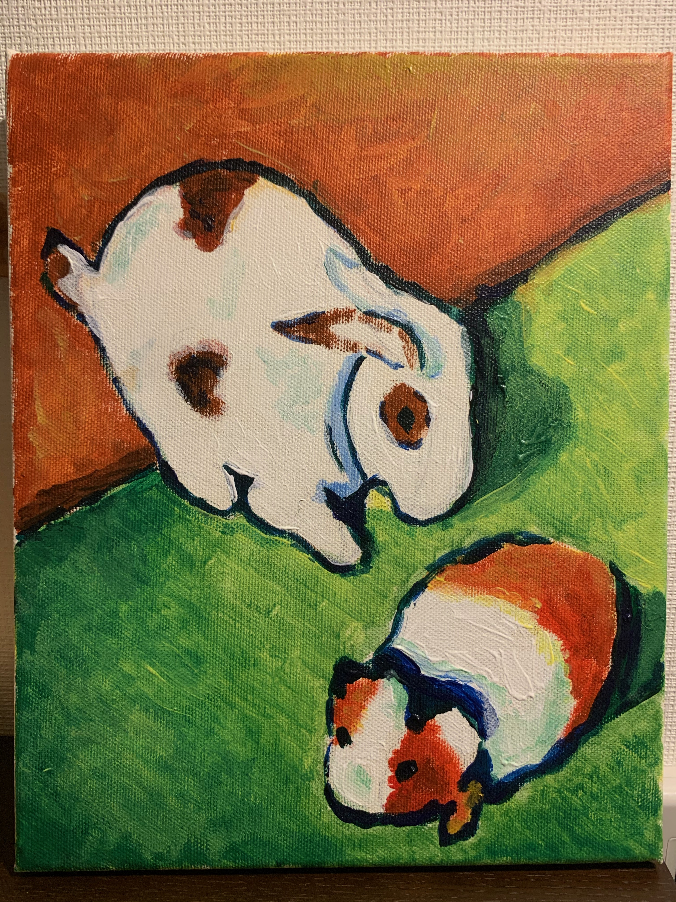
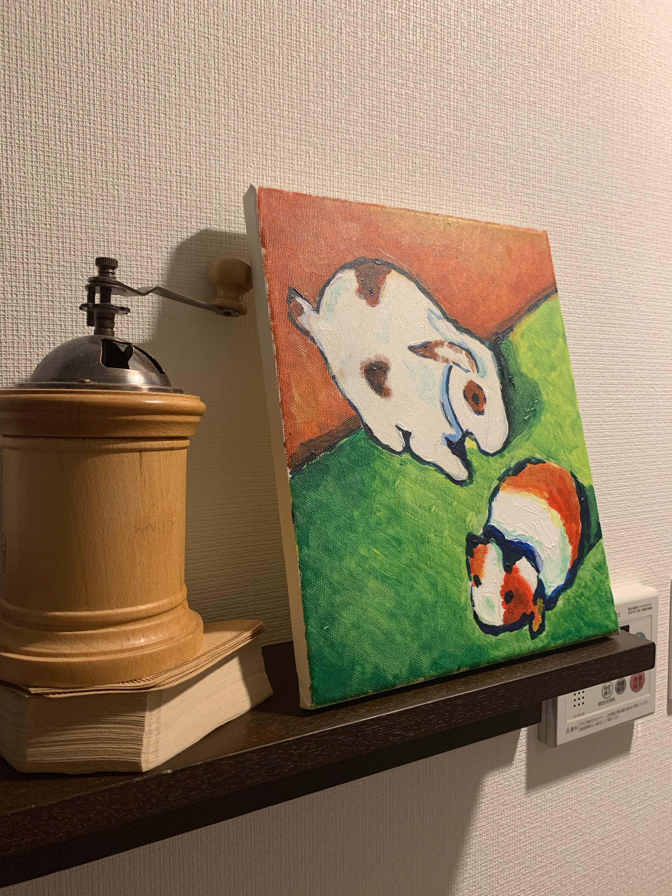

iPhoneの壁紙を何にしようか迷っておった。

応募を忘れないように，壁紙を一時的に「応用情報」の4文字にしていたからだ。

なにかいいのないかな〜と画像フォルダを漁っていると，
**August MACKE** という画家の *"Les Jouets du Petit"* （小さなおもちゃ）という作品が出てきた（タイトル画像）。

これはちょうど昨年の3月，オランジュリー美術館を訪れた時に撮ったものである。

中央の3つのおもちゃがいい塩梅に配置されるようにトリミングし，壁紙とした。

---

マッケという画家について調べてみると，いわゆる芸術運動「青騎士」を主導したメンバーの一人だそうだ。

一方で，この強烈な原色の組み合わせと，大胆に細部を省略した画面はまさにフォービズムのスタイルであり，彼が「青騎士」に到るまでにフォービズムの洗礼を受けていたことが想像される。

この写真を眺めているうちに，これを模写したい衝動に駆られた。そこで，うさぎとねずみのモチーフを描いてみた。

カンバスに絵を描いたのは，高校の美術の講義の時以来初めてだったが，思っていた感じで描くことができた。

カンバスに厚塗りすると，作品に立体感が出るような気がする。

そんな日曜でした。

