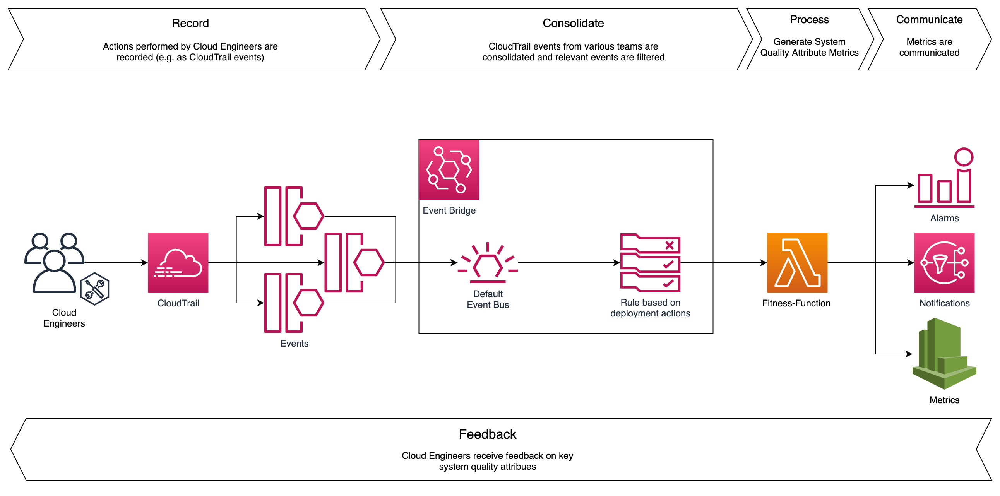

『ソフトウェアアーキテクチャの基礎』の要約（読書メモ）です。

### １章　イントロダクション

ソフトウェアアーキテクチャは以下の要素から構成される（と著者は主張する）

- 構造: システムを構成する要素の構造
- アーキテクチャ特性: システムが備えるべき特性（可用性、セキュリティ...）
- アーキテクチャ決定: 多様な選択肢の中からトレードオフを検討し決定する
- 設計指針: 設計におけるポリシー

---

#### ソフトスキル

アーキテクトに期待されることとして、著者はあえて以下のようなソフトスキルについて言及する。

- 事業ドメインの知識を持っている
- 対人スキルを持っている

これは、アーキテクトの活動が社内政治と切り離せないからである。

<Quote
    cite="要するに、アーキテクトが下すほとんどの決定は反発される。アーキテクチャ決定は、コストや作業量（時間）の増加といった面から、プロダクトオーナーやプロジェクトマネージャー、ビジネス側のステークホルダーから反発される。そして、自分たちのやり方が良いと考えている開発者からも反発される。いずれの場合も、アーキテクトは社内政治をかじ取りし、交渉術を駆使して、ほとんどの決定を承諾してもらわなければならない。"
    from="1.2.8 政治を理解し、かじ取りをする"
/>

---

#### 進化的アーキテクチャ

ソフトウェア開発プロセスは、リスク（未知の未知）に対処するため、イテレーティブになっている。これと同様に、アーキテクチャも **アーキテクチャ特性** を改善するために更新され続ける必要がある。
その手段として **適応度関数** （『進化的アーキテクチャ』で提唱）がある。

これは、アーキテクチャ特性に関する計測可能な指標（パフォーマンス、セキュリティ...）を監視し、現在のアーキテクチャの良し悪しを評価する仕組みである。

> 参考：**[Using Cloud Fitness Functions to Drive Evolutionary Architecture - AWS Architecture Blog](https://aws.amazon.com/jp/blogs/architecture/using-cloud-fitness-functions-to-drive-evolutionary-architecture/)**
>

### ２章　アーキテクチャ思考

#### トレードオフを分析する

アーキテクチャの良し悪しは一般論で決まるものではなく、企業文化、デプロイ環境、予算、期間、開発者のスキルセットなど種々の要因に依存する。

---

#### アーキテクティングとコーディングのバランス

アーキテクトはアーキテクチャ特性の向上に責務を持ちつつ、一定レベルの技術的な深さを維持できるべきである。端的に言えば、アーキテクトも開発者と一緒にコードを書いたほうが良い。

例）
- PoC を頻繁に行う。可用性・パフォーマンス向上の検討のために、２つのキャッシュソフトを使用した実装を比較する。
- 技術負債やアーキテクチャに関するストーリーを担当する。
- 適応度関数の計測を自動化する。脆弱なモジュールを CI で検知するコードを書くなど。
- コードレビューに参加する。

### ３章　モジュール性

#### モジュール性の計測

コードベースが適切にモジュール化されていることは、変更の影響範囲や学習コストの面で重要。モジュール性に関するメトリクスとしては次のようなものがある。

- 凝集度 Cohesion
- 結合度 Coupling
- 接続度 Connascence

#### コナーセンス

<Quote
    cite="システムの全体的な正しさを維持するため、あるコンポーネントの変更が別のコンポーネントの変更を必要とする場合、２つのコンポーネントはコナーセント（接続）されている。"
    from="Meilir Page-Jones"
/>

参考：[結合度の尺度「コナーセンス」とは何か](https://qiita.com/fujiharuka/items/68fadefa6dad4cf33b4d)

### ４章　アーキテクチャ特性

アーキテクチャ特性は一般に非機能特性とも呼ばれる。著者も指摘するように、アーキテクチャが備えるべきこの重要な性質を「非」機能と呼ぶのはいただけない。よって著者はアーキテクチャ特性と呼ぶ。

アーキテクチャ特性をすべて完璧に保つのは現実的ではない。よって、

- **少なくとも最悪ではないアーキテクチャ**
- **容易に変更できるアーキテクチャ**

を目指すのが良い。

### ５章　アーキテクチャ特性を明らかにする

アーキテクチャ・カタ

https://nealford.com/katas/list.html

### ６章　アーキテクチャ特性の計測と統制

#### 構造の計測

循環的複雑度: Cyclomatic Complexity

コードにおける経路の数

TDD などのエンジニアリングプラクティスは、与えられた問題領域に対して、作られるメソッドを平均的に小さく単純にするという効用がある。TDD によってテスト境界に焦点を当てながらコーディングすることになるので、CC が低く整理され高凝集なメソッドを書くことを促してくれる。

#### 統制

多くのソフトウェアプロジェクトでは、重要ではあるものの緊急性が低いアーキテクチャ特性はなおざりになりがちだ。よって、アーキテクチャには統制が必要である。
『進化的アーキテクチャ』では、機械学習や進化計算の最適化になぞらえて、アーキテクチャ適応度関数を提案している。

>**アーキテクチャ適応度関数**
>
>あるアーキテクチャ特性またはアーキテクチャ特性の組み合わせについて、客観的な整合性評価を行うための何らかの仕組み

