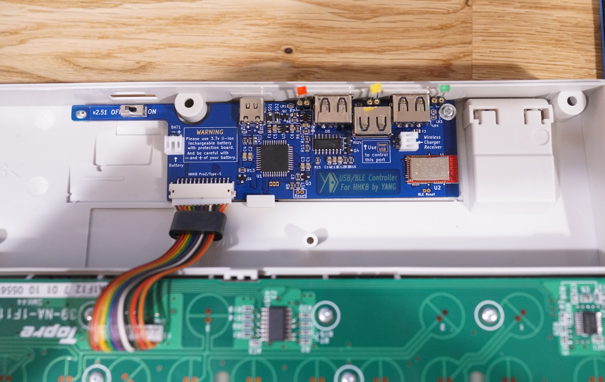
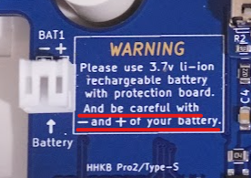
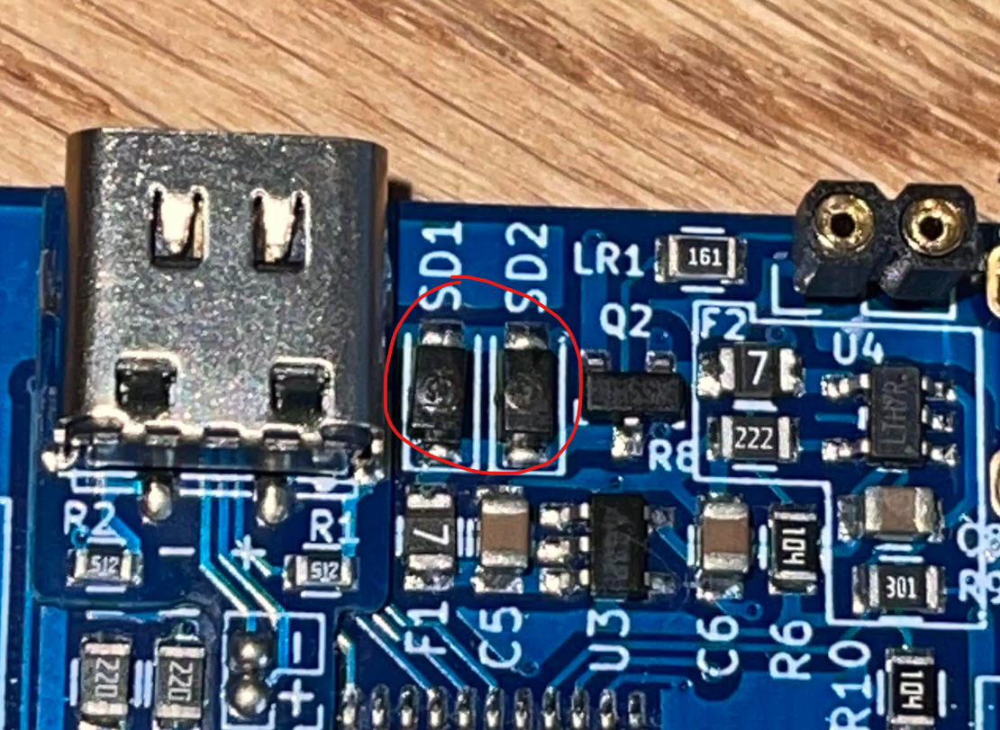

YDKB のドキュメント

### なんの記事か

- キーボード入力の自由度を高めるため、HHKB のコントローラーを YDKB HHKB BLE MOD に置き換えた
- 高いが電池の持ちがとてもいいのでおすすめ
- （自分の不注意で）回路がショートし、回路素子が破損したが、交換したら治った

### 背景

愛用する HHKB のコントローラ（キーボードを打鍵したときの電気信号を、パソコンとかが認識できる信号に変換して USB とかで出力してくれる機器）を **Alternative Controller for HHKB** by hasu から **HHKB BLE MOD** by yang に変えました。
その過程でいろいろあったのでその話を書きたいと思います。

YDKB それ自体の話はあまりしないので、機能や使い勝手をイメージしたい方は [ドキュメント](https://ydkb.io/help/#/) を読むのをおすすめします。

### YANG HHKB BLE コントローラの特徴

- BLE による省電力化 (通常のリポバッテリーで3週間程度持つ)
- [GUI](https://ydkb.io/) で気軽にキーマップを修正できる
- 小型 USB メモリをつけることで、HHKB をストレージのようにして使うことができる
- ドキュメントが比較的ちゃんと整理されている [YDKB by YAND Documentation](https://ydkb.io/help/#/)

### hasu から yang へ、コントローラ換装の動機

もともとピュアな HHKB Professional 2 を使っていたのですが、hasu コントローラで

- 無線化（Bluetooth 接続）
- ビルトインのキーマップ変更

ができるということを知り、換装しました。

しかし、**hasu コントローラの消費電力は激しく、フル充電後の無線接続は5~6時間くらいしか持たないので（3.7V/1000mA リポバッテリー使用時）、結局ずっと有線接続で使用**していました。

その後、Yang さんという方がいろいろ工夫してこの課題に取り組み、その成果を **HHKB BLE MOD** として結実させました。

BLE = Bluetooth Low Energy （Bluetooth の省電力化を実現する拡張仕様）の意

無線化信者なので買うことにしました。

2022/6/6 現在、[AliExpress](https://nl.aliexpress.com/item/1005004000607526.html?gatewayAdapt=glo2nld) で ￥13,000 前後で購入することができます。

### 購入～届く

AliExpress で購入し、3週間ほどで届きました。

そのあとは、自分好みのキーマップを専用の [GUI](https://ydkb.io/) で作成し、コントローラーに反映させます。

### 使用感

とてもいいです。

---

ここから先は、YDKB コントローラーが私の不注意でショートしてしまった話です。

### ショートする

基板にはわざわざこのような警告があるのですが、うっかり**リポバッテリーを装着する際に、+/- 極を間違えて挿入**してしまいました。

**その結果発煙（回路素子が破損）し、キーボードの入力をいっさい受け付けない**状態になってしまいました。

時間とコスト（3週間と13,000円）が無に帰し、泣いてしまいました。

### 破損個所の特定

ショートによる回路素子の故障は交換することで治せるというインターネットの教えに従い、破損個所の特定を進めることにしました。

幸いなことに今回は、発煙した周辺の回路素子の外観に破裂したような形跡が見られたので、それが破損個所であると推定できました。

また、基板上の文字からそれが SD（ショートキーダイオード）であることがわかりました。

>
> 破損部位。箱状の素子の中央部分に破裂したような形跡がある。

### 回路素子の調達・はんだづけ

破裂した素子の表面に「4S」という文字列が記述されているのがわかったので、[同一のものと思われるダイオード](https://nl.aliexpress.com/item/32430050371.html?_randl_currency=JPY&_randl_shipto=JP&src=google&memo1=freelisting&aff_fcid=2124d3af0e0d4c8aad4a279286b0bf1a-1656261556526-06424-UneMJZVf&aff_fsk=UneMJZVf&aff_platform=aaf&sk=UneMJZVf&aff_trace_key=2124d3af0e0d4c8aad4a279286b0bf1a-1656261556526-06424-UneMJZVf&terminal_id=e042671dc5f44db48bdb03475a8c5371&afSmartRedirect=y)を特定しました。
このショートキーダイオードは 40V/1A というスペックであることがわかったため、秋葉原の秋月電子通商で代替品を購入しました。

その後、1~2mm のダイオードを慣れない手つきではんだづけし、その結果**復活しました！**

よかったですね！
