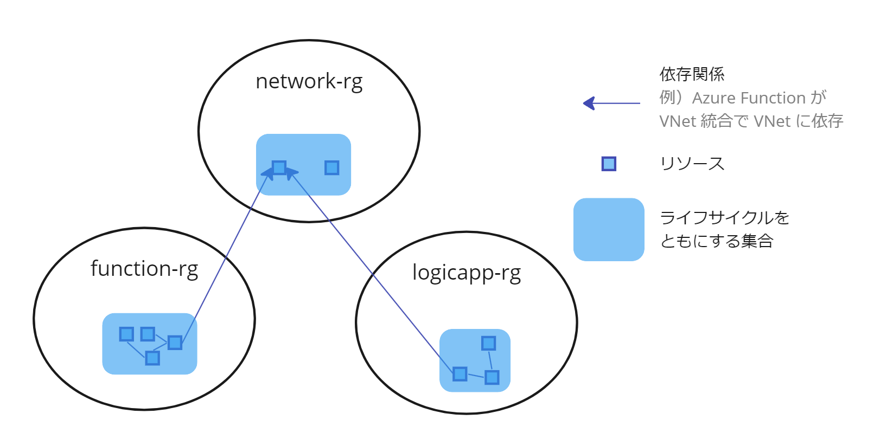

Azure Bicep を使い始めて１年くらい経ったので、個人的にリソースグループの設計や管理についてデフォルトの方針としているものを紹介します。

### TL;DR

- リソースグループは、リソースのライフサイクルで境界付ける
- リソース定義とアプリケーションコードを近くで管理する
- 環境との差異を調べ、意図しない変更を防ぐ

### リソースグループは、リソースのライフサイクルで境界付ける

<Quote
  cite="リソース グループ内のすべてのリソースで、同じライフサイクルが共有される必要がある。 そのため、これらのリソースは一緒にデプロイ、更新、削除されます。 サーバーなどの 1 つのリソースが、別のデプロイ サイクル上に存在する必要がある場合は、別のリソース グループに含めなければなりません。"
  from="Azure Resource Manager とは"
  link='https://learn.microsoft.com/ja-jp/azure/azure-resource-manager/management/overview#resource-groups'
/>

ドキュメントで推奨される通り、関係しないリソース同士は分けた方が良いです。
別の言い方をすれば、リソースグループ単体は高凝集で、リソースグループ間は疎結合な状態にするのが良いです。

理由は、

1. テンプレートをデプロイする際に、影響範囲がわからなくなる。例えば、テンプレートのデバッグをするとき、何度もデプロイしてはリソースを削除すると思います。その時に、どれがそのテンプレートに含まれていたのかを１つ１つ確認しながらリソースを消す必要がでてくる。
2. リソースグループのスコープで RBAC しづらくなる。例えば、ネットワーク（VNet など）とアプリ（Azure Functions）を管理するチームが別で、それらのリソースが同一のリソースグループにあった場合、リソース単位のスコープで RBAC するのは辛いですよね。

下記の図は、１つのリソースグループに関連しないリソースがすべて詰め込まれている状態です。

リソースのライフサイクルでリソースグループを境界づければ、次のように改善します。

1. テンプレートの影響範囲はリソースグループに閉じるので、影響範囲が明確になり、リソースグループの更新・削除がしやすくなる。
2. 個々のリソースではなくリソースグループのスコープで権限を割り当てればよく、管理オーバーヘッドが減少する。

Azure は、上記のポリシーでリソースグループが設計される前提でいろんな仕組みを作っています。

テンプレートを使用したデプロイがリソースグループ単位で行われることなどがその一例です。
このポリシーに従うことで、Azure の諸々の仕組みの恩恵を受けやすくなります。

### リソース定義とアプリケーションコードを近くで管理する

後日追記します。

### 環境との差異を調べ、意図しない変更を防ぐ

後日追記します。