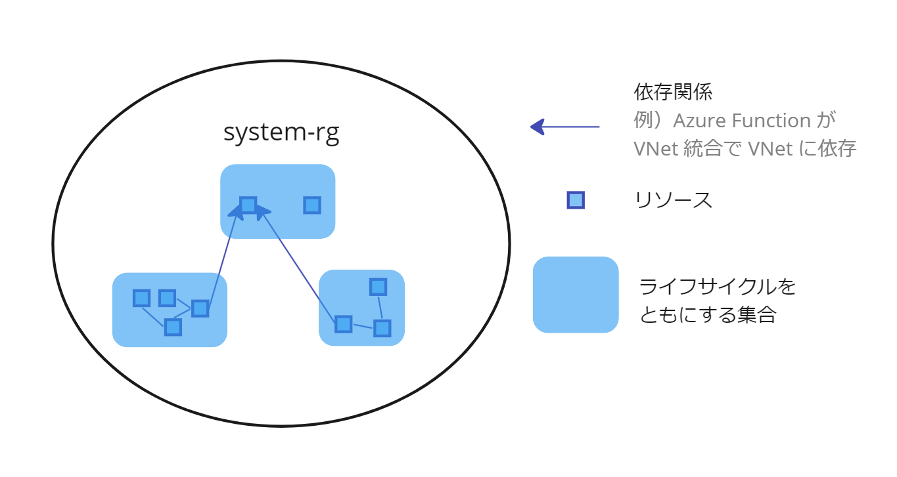

Azure Bicep を使い始めて１年くらい経ったので、個人的にリソースグループの設計や管理についてデフォルトの方針としているものを紹介します。

### TL;DR

- リソースグループは、リソースのライフサイクルで境界付ける
- リソース定義とアプリケーションコードを近くで管理する
- 環境との差異を調べ、意図しない変更を防ぐ

### リソースグループは、リソースのライフサイクルで境界付ける

<Quote
  cite="リソース グループ内のすべてのリソースで、同じライフサイクルが共有される必要がある。 そのため、これらのリソースは一緒にデプロイ、更新、削除されます。 サーバーなどの 1 つのリソースが、別のデプロイ サイクル上に存在する必要がある場合は、別のリソース グループに含めなければなりません。"
  from="Azure Resource Manager とは"
  link='https://learn.microsoft.com/ja-jp/azure/azure-resource-manager/management/overview#resource-groups'
/>

ドキュメントで推奨される通り、関係しないリソース同士は分けた方が良いです。
別の言い方をすれば、リソースグループ単体は高凝集で、リソースグループ間は疎結合な状態にするのが良いです。

理由は、

1. テンプレートをデプロイする際に、影響範囲がわからなくなる。例えば、テンプレートのデバッグをするとき、何度もデプロイしてはリソースを削除すると思います。その時に、どれがそのテンプレートに含まれていたのかを１つ１つ確認しながらリソースを消す必要がでてくる。
2. リソースグループのスコープで RBAC しづらくなる。例えば、ネットワーク（VNet など）とアプリ（Azure Functions）を管理するチームが別で、それらのリソースが同一のリソースグループにあった場合、リソース単位のスコープで RBAC するのは辛いですよね。

下記の図は、１つのリソースグループに関連しないリソースがすべて詰め込まれている状態です。



リソースのライフサイクルでリソースグループを境界づければ、次のように改善します。

1. テンプレートの影響範囲はリソースグループに閉じるので、影響範囲が明確になり、リソースグループの更新・削除がしやすくなる。
2. 個々のリソースではなくリソースグループのスコープで権限を割り当てればよく、管理オーバーヘッドが減少する。


Azure は、上記で述べたポリシーでリソースグループを設計する前提でいろんな仕組みを作っています。

特に理由がなければ高凝集・疎結合なリソース設計をおすすめします。

---

具体例として、Azure Function のテンプレート定義の可視化したものを下記に示します。なおこのテンプレートは、MS が公開している [azure-quickstart-templates](https://github.com/Azure/azure-quickstart-templates/blob/master/quickstarts/microsoft.web/function-app-storage-private-endpoints/main.bicep) の抜粋です。

この例では、Azure Function を動かすのに必要十分な一式のリソースが定義されています。


もし VNet や App Service Plan が複数チームで共有されるような場合は、リソースグループを分けた方が良いと思います。

### リソース定義とアプリケーションコードを近くで管理する

当たり前に感じる人も多いかと思いますが、特に事情がなければ、リソース定義とアプリケーションコードは同一リポジトリで管理するのが良いと思います。

アプリケーションコードと Dockerfile を同一リポジトリに配置するのと同じです。「IaC」「アプリ」みたいな技術スタックでリポジトリを分けるのは一見合理的に聞こえるかもしれませんが、技術スタックを跨いだ変更が辛くなります。私は一度、技術スタックごとに担当者がいるチームでそれをやって辛い思いをしました。

### 環境との差異を調べ、意図しない変更を防ぐ

一般に IaC ツールには、定義と実際のリソースとの差分を検出する機能があります。

ARM にも同様の機能があるので、リソース定義の CD Pipeline に差分検出の仕組みを入れることをおすすめします。

コマンド例：

```bash
az deployment sub what-if `
  -x NoChange Ignore `
  --only-show-errors `
  -f templates/vnet.bicep `
  --location japaneast `
  --parameters `
    env=$(env) `
    --only-show-errors
```

実行結果の例：

>
>
> [ARM テンプレート デプロイの What-If 操作](https://learn.microsoft.com/ja-jp/azure/azure-resource-manager/templates/deploy-what-if?tabs=azure-powershell)

以下のようにマルチステージなデプロイを定義すれば「差分を事前に検出し、意図した変更であれば承認してリリースする」仕組みを作ることができます。

```
🤖差分検出 ---> 🙍目視で差分を確認・承認 ---> 🤖デプロイ
```

> 📚 承認の仕組みについては公式ドキュメントが詳しいです。
>
> [Azure DevOps - Define approvals and checks](https://learn.microsoft.com/en-us/azure/devops/pipelines/process/approvals?view=azure-devops&tabs=check-pass#approvals)

---

### まとめ

Azure で IaC やる中でデフォルトとしているポリシーについて紹介しました。
チームに人が増えていくと、みんながそれぞれ好き勝手にやって複雑で認知負荷の高いリポジトリやリソース構成が出来上がることが（経験上）多いので、こうしたポリシーはあらかじめみんなで話し合って明文化しておくと良いと思います。
